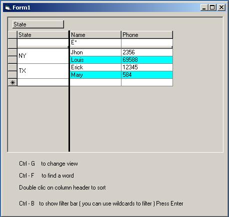

## True DB Grid 7\.0 Generic Class

### Description

Generic Library to improve the Component One True OleDb Grid 7.0

Allow Filter, Grouping, searching, Sorting,Copyng.

Filter library also included.

To download the ocx trial version go to www.componentone.com
 
### More Info
 
You need to have Component One TrueOleDbGrid 7.0 and Ado 2.5. To download ocx trial version go to www.componentone.com

can use version 6 or 5 by just changing the reference and replacing the grid in the form.

             |
---                |---
**Submitted On**   |2002-04-23 09:10:16
**By**             |[Erick Antelo](https://github.com/Planet-Source-Code/PSCIndex/blob/master/ByAuthor/erick-antelo.md)
**Level**          |Intermediate
**User Rating**    |4.7 (28 globes from 6 users)
**Compatibility**  |VB 6\.0, VBA MS Access
**Category**       |[Libraries](https://github.com/Planet-Source-Code/PSCIndex/blob/master/ByCategory/libraries__1-49.md)
**World**          |[Visual Basic](https://github.com/Planet-Source-Code/PSCIndex/blob/master/ByWorld/visual-basic.md)
**Archive File**   |[True\_DB\_Gr748544232002\.zip](https://github.com/Planet-Source-Code/erick-antelo-true-db-grid-7-0-generic-class__1-34050/archive/master.zip)

